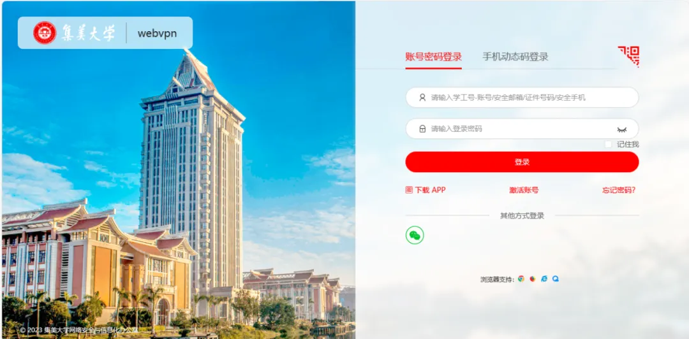

# VPN使用小贴士

## **什么是VPN**


VPN服务，是为方便本校师生在校园网覆盖区域以外随时访问校内资源而开通的服务，通过它我们可以远程登陆校园内网，获取一些校园网内部的资源。


学校提供**WebVPN**和**SVPN**两种，WebVPN面向全校师生开放，SVPN面向教职工开放。

### **WEBVPN**

WebVPN是基于网页端的VPN服务，只需使用浏览器登陆后即可访问校内<mark style="color:red;">**网页端资源**</mark>。满足师生在校外使用学校购买的图书馆资源、限制校内访问的网站等。

### **SVPN**

SVPN需要下载安装插件，通过插件连接至校内网络。拨入成功后，用户除了可访问校内网页端资源以外，还可远程访问校内办公电脑等<mark style="color:red;">**客户端资源**</mark>。

<mark style="color:orange;">重要提醒：校外访问我校常用信息系统（如i集大、OA、教务、学工、科研等系统）</mark><mark style="color:orange;">**无需**</mark><mark style="color:orange;">拨入VPN，直接通过i集大访问即可。</mark>

## **WebVPN登陆方式**

### 1.、访问地址



### 2、使用统一认证登录

<figure><figcaption></figcaption></figure>

### 3、导航栏访问  .png>)

### 4、搜索栏访问

.png>)

## **SVPN登陆方式**

### 1. 访问地址



### 2、使用统一认证登录

<figure><figcaption></figcaption></figure>

### 3. 直接访问校内资源即可。

**Tips：**&#x9996;次登录SVPN会自动下载安装登录客户端和控件，安装时请<mark style="color:orange;">**关闭360安全管家等软件**</mark>，否则有可能导致安装失败，无法拨入成功。

## **安全提示**


1.VPN账号属于专人专用，**禁止将账号、密码外借他人**。

2.尽量不要在公共场所（如网吧、公用网络环境等）使用VPN拨入校园网。


&#x20;

> 信息来源：集美大学网信办
>
> [https://mp.weixin.qq.com/s?\_\_biz=Mzk0ODQ0OTM2MQ==\&mid=2247495683\&idx=1\&sn=e60274e2920c93c473bb70025de09efe\&chksm=c2da2815a97d405d985b98bf5cf183cd75b3b6bc125baed6849cbb4505ce872e55c9b0f34f38#rd](https://mp.weixin.qq.com/s?__biz=Mzk0ODQ0OTM2MQ==\&mid=2247495683\&idx=1\&sn=e60274e2920c93c473bb70025de09efe\&chksm=c2da2815a97d405d985b98bf5cf183cd75b3b6bc125baed6849cbb4505ce872e55c9b0f34f38#rd)
